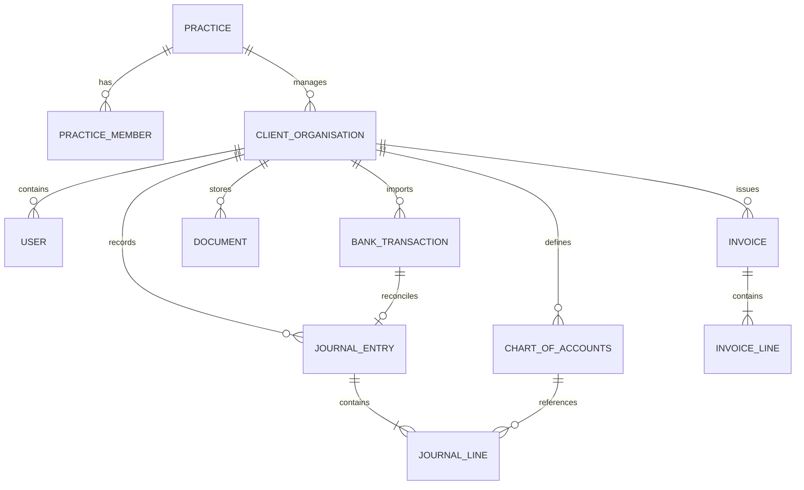

# Wealth Wise Accountant — System Architecture & Data Model Baseline

**Document Version:** 1.0.0  
**Status:** Architecture Baseline  

---

## 1. Technical Stack Overview

* **Frontend:** Next.js (App Router), React 19, TypeScript, Tailwind CSS, Lucide Icons
* **State & Data Handling:** React Server Components (RSC) + Client state for interactive reconciliation grids
* **Backend Services:** Next.js Server Actions & API Routes, strict Zod schema validation
* **Database & Persistence (Target):** PostgreSQL with Row-Level Security (RLS) for tenant isolation
* **Storage:** S3-compatible private object storage with time-limited signed URLs for client financial documents

---

## 2. Core Relational Data Model (Target PostgreSQL Schema)



### Key Entity Definitions

1. **`practices`**: The accounting firm account (Wealth Wise Accountant).
2. **`client_organisations`**: Individual business entities (Ltd companies, sole traders) managed by the practice.
3. **`chart_of_accounts`**: Nominal codes (e.g., `1000 - Bank Current Account`, `2000 - Accounts Payable`, `4000 - Sales Revenue`, `7000 - Rent`).
4. **`journal_entries`**: Header record for general ledger entries. Must include: `id`, `org_id`, `entry_date`, `reference`, `status` (`DRAFT`, `POSTED`, `REVERSED`), `created_by`.
5. **`journal_lines`**: Individual line items. Must include: `entry_id`, `account_code`, `debit_pence` (BIGINT), `credit_pence` (BIGINT), `description`.
   * **Database Constraint:** `CHECK (debit_pence >= 0 AND credit_pence >= 0)`
   * **Database Invariant:** Trigger on `journal_entries` post: `SUM(debit_pence) - SUM(credit_pence) = 0`.
6. **`draft_ingestion_queue`**: Quarantine table where OCR and AI transaction extractions land for accountant verification prior to general ledger posting.

---

## 3. Strict Security & Tenancy Model

1. **Row-Level Security (RLS):** Every financial table contains an `organisation_id` column. Tenant queries enforce:
   ```sql
   WHERE organisation_id = current_setting('app.current_org_id')::uuid
   ```
2. **Accountant Impersonation / Multi-Tenancy:** Practice staff have scoped memberships granting access across authorized `client_organisations`, with full audit logging on every read/write action.
3. **Document Access:** Raw receipts, bank statements, and tax invoices are stored in encrypted buckets; client browsers only access documents via signed URLs with a 15-minute time-to-live (TTL).
